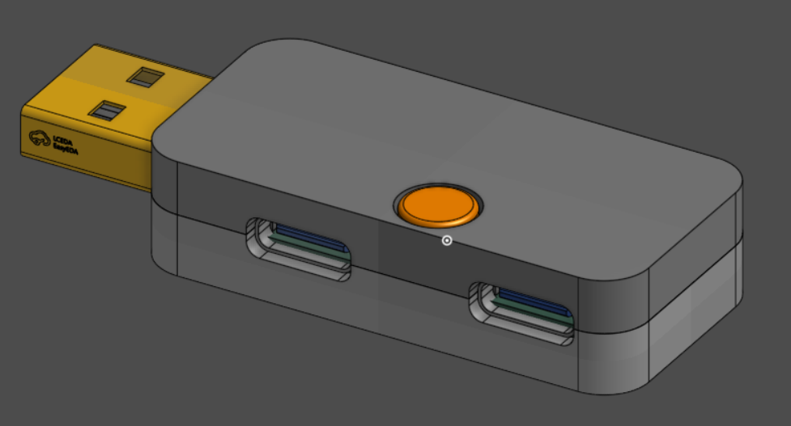
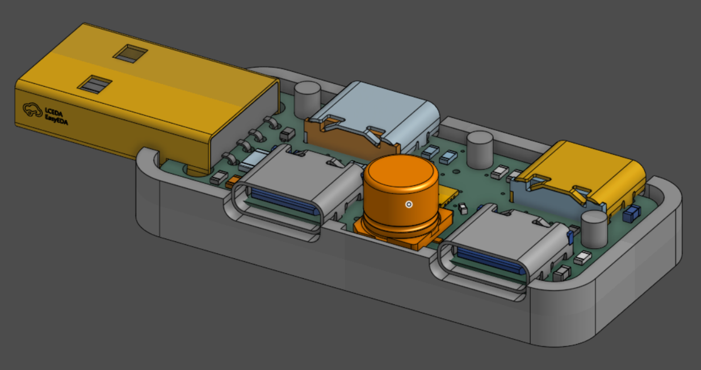
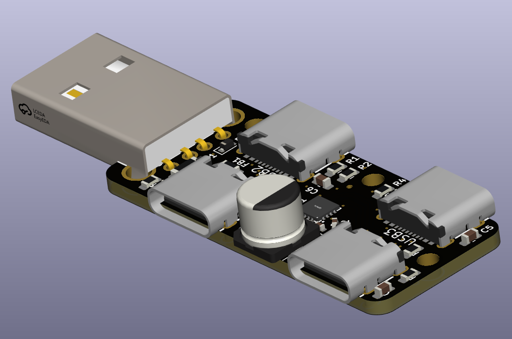
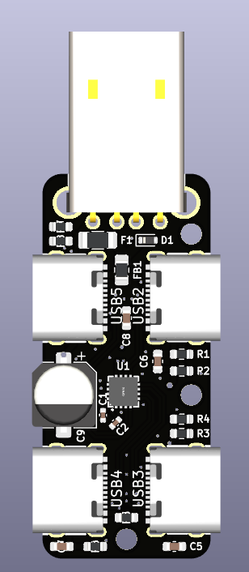
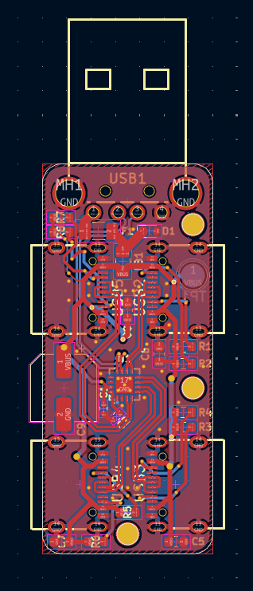
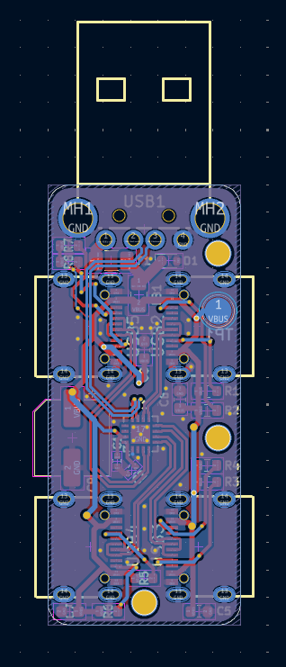

# Skibidi USB C Hub

speedrunning a usb a to 4 port usb c hub in school xd

i had an old computer that only has usb a ports, so i made this hub to extend those ports to usb c

ch334 my love. i <3 wch

## Links

Onshape: https://cad.onshape.com/documents/2453a6f2426758a8164db13e/w/aaae3aa11a76b09d86b06c41/e/a0f10c7f22eb2d735bb89467?renderMode=0&uiState=698d8565a52609b0fe224337

Kicanvas: https://kicanvas.org/?repo=https%3A%2F%2Fgithub.com%2Ftobycm%2Fskibidi-usb-c-hub%2Ftree%2Fmain%2Fpcb

Repo: https://github.com/tobycm/skibidi-usb-c-hub

## 3D render

## PCB

## BOM

| Description | Quantity | Part # | Unit Price | Extended Price USD | Product Link |
| :--- | :---: | :--- | :---: | :---: | :--- |
| USB-A (USB TYPE-A) Receptacle Connector 4 Position Right Angle | 20 | AM90 | 0.0646 | 1.29 | [Link](https://www.lcsc.com/product-detail/C404965.html) |
| Polymeric PTC Resettable Fuse 12V 2A Surface Mount 1206 | 20 | BSMD1206-200-12V | 0.0612 | 1.22 | [Link](https://www.lcsc.com/product-detail/C883135.html) |
| 18.6VC Clamp 9.4A@8/20us Ipp ESD DIODE SOD-523 | 20 | ESD5Z5.0T1G | 0.0387 | 0.77 | [Link](https://www.lcsc.com/product-detail/C82044.html) |
| 220Ω@100MHz 1 Line Ferrite Bead 0805 2A 45mΩ | 50 | BLM21PG221SN1D | 0.0167 | 0.84 | [Link](https://www.lcsc.com/product-detail/C85840.html) |
| 220uF ±20% 10V SMD,D6.3xL5.8mm 2000hrs | 20 | HV1A227M0605PZ | 0.1242 | 2.48 | [Link](https://www.lcsc.com/product-detail/C5246513.html) |
| LCSC Shipping | - | LCSC Shipping | 13.16 | 13.16 | [Link](https://www.lcsc.com/) |
| LCSC Handling Fee | - | LCSC Handling Fee | 3 | 3 | [Link](https://www.lcsc.com/) |
| PCB | - | PCB | 6.1 | 6.1 | [Link](https://jlcpcb.com/) |
| PCBA | - | PCBA | 25.44 | 25.44 | [Link](https://jlcpcb.com/) |
| JLCPCB Shipping | - | JLCPCB Shipping | 8.53 | 8.53 | [Link](https://jlcpcb.com/) |
| **Total** | | | | **62.84** | |

## End notes

This project was funded by [Blueprint](https://blueprint.hackclub.com/), a grant program by Hack Club that supports open source hardware projects for teenagers.